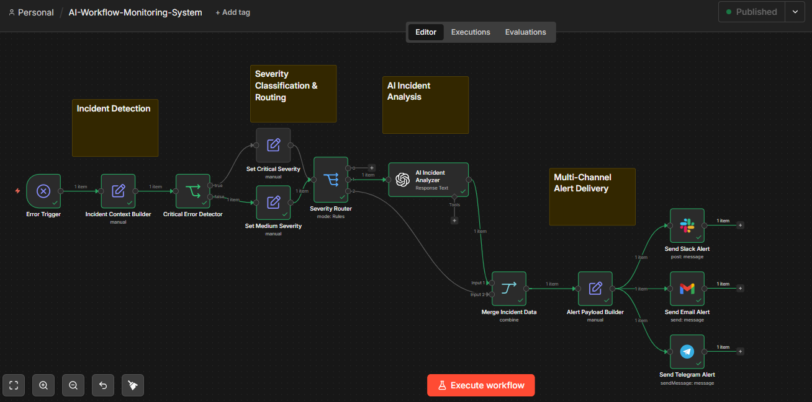
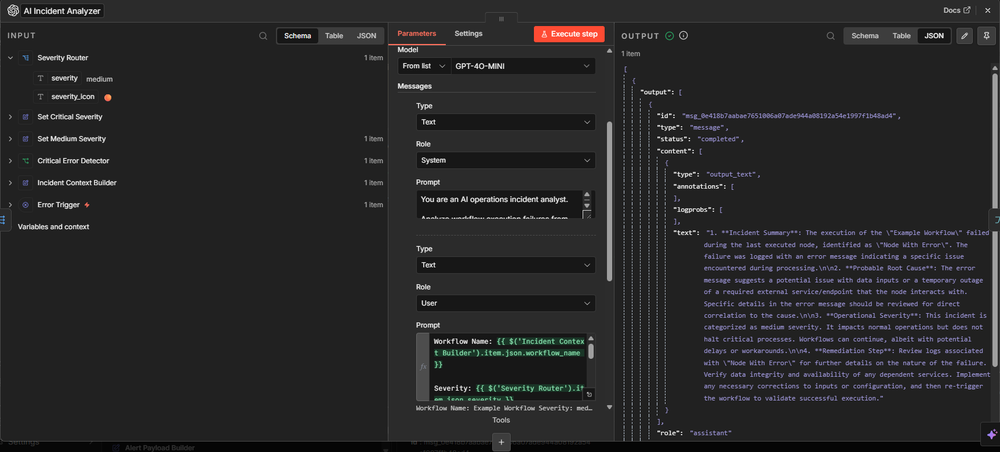
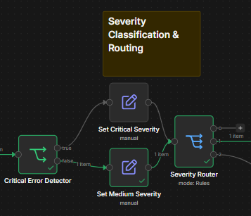
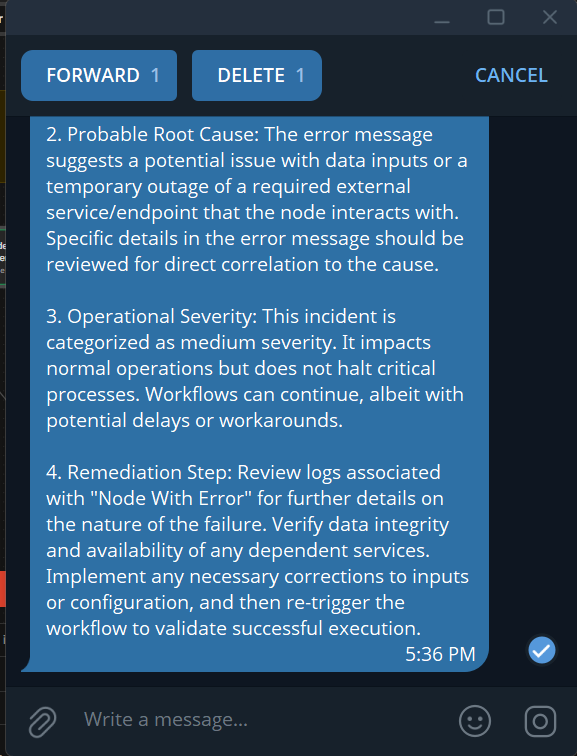
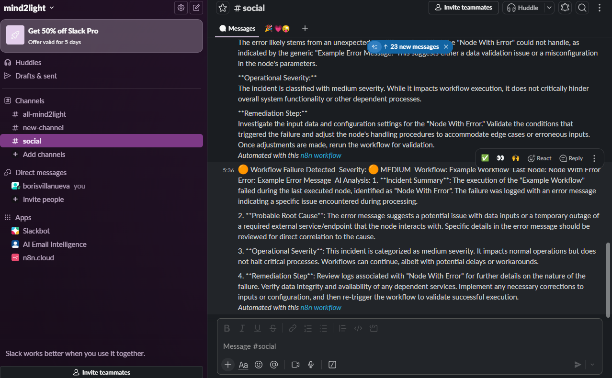
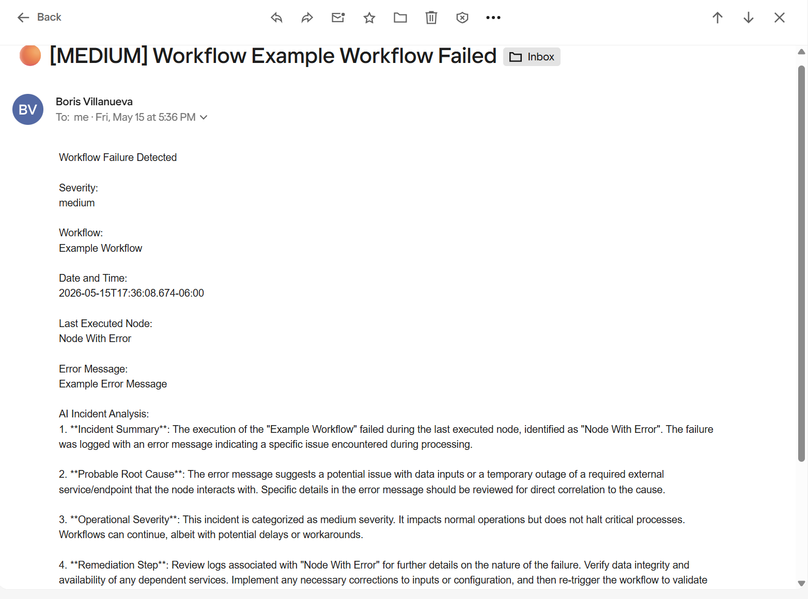

# AI-Workflow-Monitoring-System

AI-powered workflow monitoring and incident alerting system built with n8n, OpenAI, Slack, Gmail, and Telegram.

This workflow detects automation failures in real time, classifies incident severity, generates AI-assisted operational analysis, and delivers multi-channel alerts for faster troubleshooting and operational visibility.

---

# Overview

Modern automation systems require operational visibility and rapid incident response.

This project demonstrates how AI can be integrated into workflow reliability engineering to automatically:

- Detect workflow execution failures
- Classify operational severity
- Analyze incidents using AI
- Generate remediation guidance
- Deliver alerts across multiple communication channels

The system is designed using a normalized incident payload architecture that separates:

- Incident detection
- Severity classification
- AI analysis
- Payload normalization
- Alert delivery

---

# Features

## Real-Time Workflow Failure Detection

Uses the n8n Error Trigger node to automatically capture failed workflow executions.

## Incident Context Normalization

Builds a structured incident payload containing:

- Workflow name
- Last executed node
- Error message
- Timestamp
- Workflow ID

## Severity Classification Engine

Automatically categorizes failures into operational severity levels.

Current supported severities:

- Critical 🔴
- Medium 🟠

Critical detection includes:

- Timeout failures
- Authentication failures
- Unauthorized access
- Quota issues
- Rate limiting

## AI Incident Analysis

Uses OpenAI GPT-4o-mini to generate:

- Incident summaries
- Probable root causes
- Operational severity assessments
- Recommended remediation steps

## Multi-Channel Alert Delivery

Delivers alerts simultaneously to:

- Gmail
- Slack
- Telegram

## Alert Payload Normalization

Centralized payload builder ensures all delivery channels receive a consistent operational incident structure.

---

# Workflow Architecture

## Incident Detection

- Error Trigger
- Incident Context Builder

## Severity Classification & Routing

- Critical Error Detector
- Set Critical Severity
- Set Medium Severity
- Severity Router

## AI Incident Analysis

- AI Incident Analyzer
- Merge Incident Data

## Payload Normalization

- Alert Payload Builder

## Multi-Channel Alert Delivery

- Send Email Alert
- Send Slack Alert
- Send Telegram Alert

---

# Screenshots

## Full Workflow Overview



## AI Incident Analysis



## Severity Routing Logic



## Telegram Alert Example



## Slack Alert Example



## Email Alert Example



---

# Technologies Used

- n8n
- OpenAI GPT-4o-mini
- Slack API
- Telegram Bot API
- Gmail API

---

# Use Cases

- Workflow monitoring
- AI-assisted incident response
- Operational alerting
- Reliability engineering
- Automation observability
- Incident escalation pipelines

---

# Installation

## Requirements

- n8n instance
- OpenAI API credentials
- Slack OAuth credentials
- Telegram bot credentials
- Gmail OAuth credentials

## Import Workflow

1. Open n8n
2. Import the workflow JSON file from:

```text
workflow/AI-Workflow-Monitoring-System.json
```

3. Configure credentials:

- OpenAI
- Slack
- Telegram
- Gmail

4. Activate the workflow

---

# Example Incident Alert

```text
🟠 Workflow Failure Detected

Severity: 🟠 MEDIUM

Workflow: Example Workflow

Last Node: Node With Error

Error:
Example Error Message

AI Analysis:
- Incident summary
- Root cause analysis
- Operational severity
- Remediation guidance
```

---

# Repository Structure

```text
AI-Workflow-Monitoring-System/
├── README.md
├── LICENSE
├── workflow/
│   └── AI-Workflow-Monitoring-System.json
└── screenshots/
    ├── hero-workflow-overview.png
    ├── ai-incident-analysis.png
    ├── severity-routing-system.png
    ├── slack-incident-alert.png
    ├── telegram-incident-alert.png
    └── email-incident-alert.png
```

---

# Future Improvements

Potential future enhancements:

- Incident persistence database
- Dashboard visualization
- Retry automation
- PagerDuty integration
- AI-powered incident prioritization
- Historical incident analytics
- Service dependency mapping

---

# Author

Boris Villanueva

GitHub:
https://github.com/borisvillanueva

LinkedIn:
https://www.linkedin.com/in/borisvillanueva/

